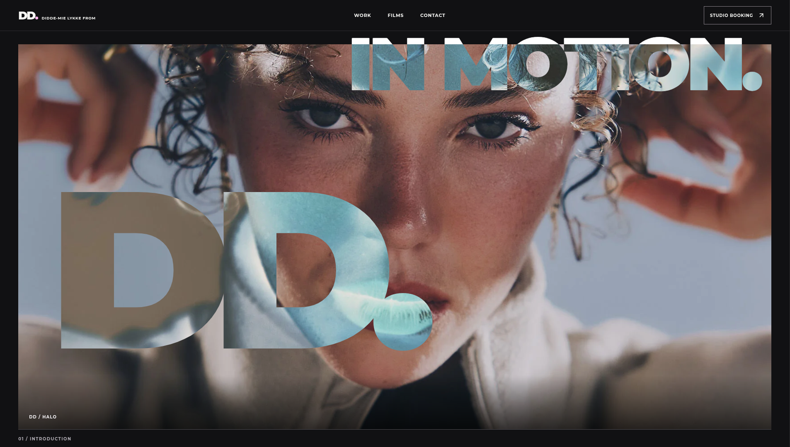
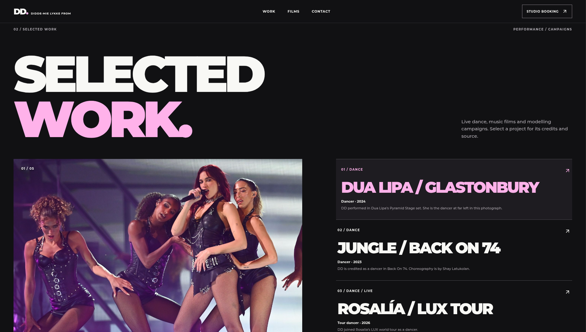

# DD website

A website for my friend Didde-Mie Lykke From (DD), a dancer and choreographer. It brings together her personal portfolio of selected performance, film and modelling work and a separate DD Studio booking preview.

  
  

The personal site uses **Astro, React, TypeScript and CSS**. The studio site uses **Next.js, React and TypeScript**, with a local **pretix Community** availability preview backed by PostgreSQL and Redis. Booking and payment are not live.

Portfolio image credits and usage status are recorded in the [editorial media ledger](apps/personal/EDITORIAL_MEDIA_LEDGER.md).
