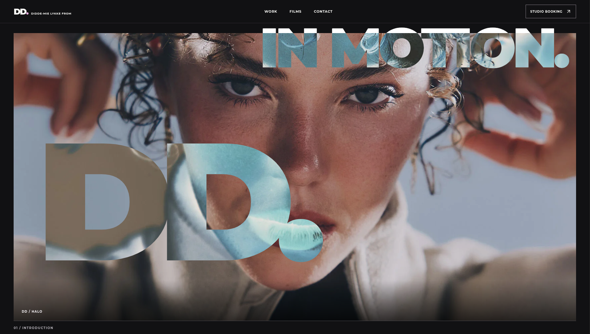
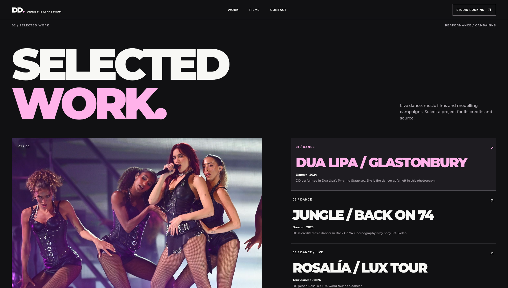

# DD website

A website for Didde-Mie Lykke From, a dancer and choreographer. It brings together her personal portfolio of selected performance, film and modelling work and a separate TTD Studio booking site for the dance studio and events.

  
  

The personal site uses **Astro, React, TypeScript and CSS**. The studio site uses **Next.js, React and TypeScript**, with a local **pretix** booking system using Stripe for payment backed by PostgreSQL and Redis. The studio events calendar reads pretix events and dates.

Shared server mechanisms live in `server/`; primary and booking communications run with distinct credentials and marketing schemas. Booking management/notifications live in `apps/booking/server` and a supervised worker. The booking stack can start independently of the unfinished static primary site.

See [architecture/checklist](docs/architecture/IMPLEMENTATION_PLAN.md), [implementation evidence](docs/architecture/IMPLEMENTATION_NOTES.md), [operations](docs/architecture/OPERATIONS.md) and [owner launch actions](docs/architecture/OWNER_FOLLOW_UP.md). Run `npm run verify:infrastructure` for tests, type checks and independent production builds. Local private envs/captures are ignored; never commit them. Deployment/provider/paid-sandbox verification and launch approval remain separate work.
